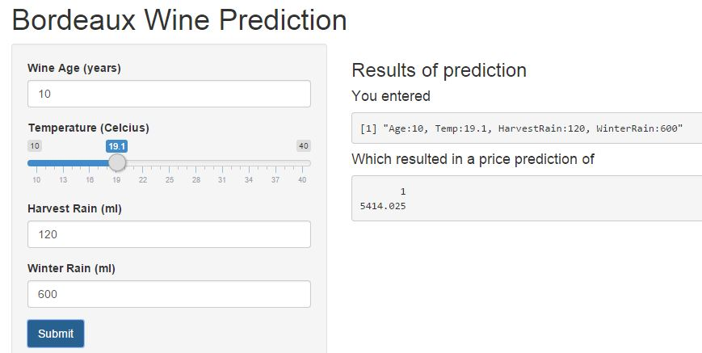

## Wine Regressions Shiny App

as Reported in Chance Magazine by Orley Ashenfelter

--- .class #id 

## The study

- Orley Ashenfelter from Princeton argued that he could predict the quality (and therefore the price) of wine
without tasting it by the help of linear regression using  weather related variables.  
The paper can be found  [here](http://ageconsearch.umn.edu/bitstream/37297/2/AAWE_WP04.pdf)

- Orley Ashenfelter faced strong criticism from Robert Parker a famous wine expert

- However Orley Ashenfelter's model proved quite succesfull regarding auction prices  
and many times he beat experts' opinions 

 


--- .class #id 

## Wine data and variables 
*The data were downloaded from MITx's course The Analytics edge*  [here](https://www.edx.org/course/analytics-edge-mitx-15-071x-0) 


```r
wine = read.csv("./wine.csv"); head(wine,2)
```

```
##   Year  Price WinterRain    AGST HarvestRain Age
## 1 1952 7.4950        600 17.1167         160  31
## 2 1953 8.0393        690 16.7333          80  30
```
### **The variables:**
<table>
<tr>
<td>(Dependent variable) Price:</td>
<td>typical price (log) in 1990-1991 wine auctions</td>
</tr>
</tr>
<tr>
<td><hr></td>
<td></td>
</tr>
<tr>
<td>(Indepedent Variables)</td>
<td></td>
</tr>
<tr>
<td>Age:</td>
<td>the age (years) of the wine bottle</td>
</tr>
<tr>
<td>AGST (Temperature):</td>
<td>average growing season temperature (degrees celcius) April-Sept</td>
</tr>
<tr>
<td>Harvest Rain:</td>
<td>harvest period (August and Sept.) rain in (ml)</td>
</tr>
<tr>
<td>Winter Rain:</td>
<td>winter period (Oct.-March) rain in (ml)</td>
</tr>
</table>


--- .class #id 

## Building the model


```r
wineModel<-lm(Price ~ Age+AGST + HarvestRain + WinterRain , data=wine)
summary(wineModel)$adj.r.squared;summary(wineModel)$coefficients
```

```
## [1] 0.7961738
```

```
##                 Estimate   Std. Error   t value     Pr(>|t|)
## (Intercept) -3.651570330 1.6880876083 -2.163140 4.166538e-02
## Age          0.023848014 0.0071666557  3.327635 3.054914e-03
## AGST         0.616391558 0.0951746617  6.476425 1.626099e-06
## HarvestRain -0.003860600 0.0008075278 -4.780764 8.970404e-05
## WinterRain   0.001166719 0.0004820325  2.420416 2.420786e-02
```
Interpretation  Examples
- One year increase in age (holding all other constant) will result in 2.3% increase in the price
- One degree C increase in avg growing temperature (all other constant) will result in 61.6% price increase


--- .class #id 

## Shiny app: screenshot



*Click* [here] (https://psifio.shinyapps.io/shinyappWinePrediction)  *to go to shinyapps.io*

--- .class #id 

## Shiny app: usage
- The model is initialised once in server.R
- User selects values for parameters Age, Temperature, Harvest Rain, Winter Rain.
- User hits submit 
- Regression predicts log(price) and we return the exponent value

--- .class #id 


## Shiny app: ui.R 1/2
```
shinyUI(
  pageWithSidebar(
    headerPanel("Bordeaux Wine Prediction"),
    sidebarPanel(
      numericInput('Age', 'Wine Age (years)', 10, min = 0, max = 100, step = 1),
      sliderInput('AGST','Temperature (Celcius)', 10, 40, 16.5, step = 0.1, round = FALSE, 
                  ticks = TRUE, animate = FALSE),
      numericInput('HarvestRain', 'Harvest Rain (ml)', 140, min = 0, max = 2000, step = 10),
      numericInput('WinterRain', 'Winter Rain (ml)', 600, min = 0, max = 2000, step = 10),
      submitButton('Submit'),
      h4("Enter values and hit submit to calculate price"),
      br(),
      p("With this app one can predict prices for vintage bordeaux wines. The depedent variables are:"),
      strong("Age:"),
      em("wine's age in years"),br(),strong("Temperature:"),
      em("average growing temperature (degrees celcius) April-Sept"),br(),
      strong("Harvest Rain:"),
      em("Harvest (August and Sept.) rain in (ml)"),
```

--- .class #id 

## Shiny app: ui.R 2/2

```
      ,br(), strong("Winter Rain:"),em("Winter (Oct.-March) rain in (ml)"),  
      br(), br(),
      p("This app is a reproduction of Orley Ashenfelter's study",
        a("Predicting the Quality and Prices of Bordeaux Wines .", 
          href = "http://www.wine-economics.org/workingpapers/AAWE_WP04.pdf")),
      p("Wine dataset downloaded from course: ",
        a("MITx Analytics edge.", 
          href = "https://www.edx.org/course/analytics-edge-mitx-15-071x-0"))
    ),
    mainPanel(
        h3('Results of prediction'),
        h4('You entered'),
        verbatimTextOutput("inputValue"),
        h4('Which resulted in a price prediction of '),
        verbatimTextOutput("prediction")
    )
  )
)
```

--- .class #id 

## Shiny app: server.R


```
  wine = read.csv("data/wine.csv")
  wineModel<-lm(Price ~ Age+AGST + HarvestRain + WinterRain , data=wine)

  getPricePrediction <- function(paramAge,paramAGST,paramHarvestRain,paramWinterRain){
    userinput=data.frame(Age=paramAge,AGST=paramAGST,
                        HarvestRain=paramHarvestRain, WinterRain=paramWinterRain)
    predict(wineModel, newdata=userinput)
} 

shinyServer(
  function(input, output) {
    output$inputValue <- renderPrint({
      paste("Age:",input$Age, ", Temp:",input$AGST,
            ", HarvestRain:",input$HarvestRain,", WinterRain:",input$WinterRain, sep = "")
    })
    output$prediction <- renderPrint({
      exp(getPricePrediction(input$Age,input$AGST,input$HarvestRain,input$WinterRain))  })
  }
)
```

--- .class #id 

## Thank you!


